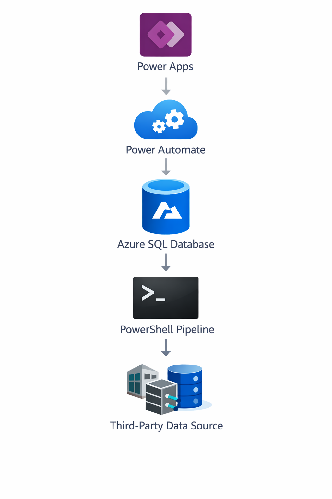
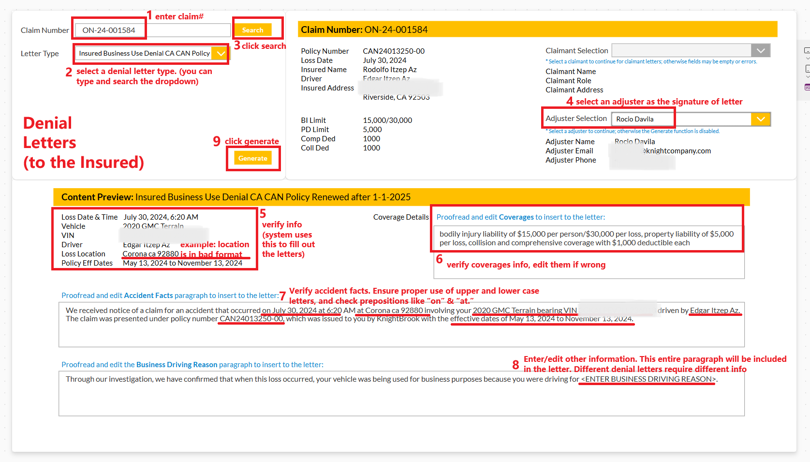

# Claims Letter Automation Platform

An end-to-end claims correspondence automation system that integrates Azure SQL, PowerShell pipelines, and Microsoft Power Platform to generate standardized claim letters for adjusters.

---

## Architecture

---

## Overview

This project automates the process of generating claim-related letters (e.g., denial, acknowledgment) by integrating data pipelines, database logic, and low-code applications.

Adjusters can input a claim number and select a letter type through a Power Apps interface. The system retrieves claim and policy data, generates a formatted letter, and allows users to download or send it via email automatically.

---

## Application Demo

### Power Apps Frontend Interface

---

## Application Flow

Adjuster (User)  
↓  
Power Apps (Frontend UI)  
↓  
Power Automate (Workflow Trigger)  
↓  
Azure SQL Stored Procedure  
↓  
Claims & Policy Data  
↓  
Generated Letter  
↓  
Download / Email  

---

## Business Problem

Claims adjusters previously had to:
- manually gather claim and policy data
- write letters individually
- risk inconsistencies and errors

This system was built to:
- standardize claim correspondence
- reduce manual effort
- minimize human error
- improve operational efficiency

---

## Key Features

### Automated Data Pipeline
- Extracts claim and insured data from third-party systems
- Uses PowerShell scripts for scheduled data transfer
- Loads data into Azure SQL

### SQL-Based Letter Engine
- Complex SQL queries aggregate claim, vehicle, and policy data
- Coverage limits and policy details are dynamically constructed
- Supports multiple letter types (denial, acknowledgment)

### Dynamic Policy Logic
- Generates coverage descriptions based on policy data
- Applies state-specific logic for regulatory wording
- Builds human-readable insurance language automatically

### Power Platform Integration
- Power Apps: user interface for adjusters
- Power Automate:
  - triggers workflows
  - executes stored procedures
  - generates documents
  - sends emails automatically

### End-to-End Automation
- Input: Claim Number + Letter Type  
- Output:
  - generated letter
  - downloadable file
  - automated email delivery  

---

## Data Pipeline

Third-Party Data Source  
↓  
PowerShell Scripts  
↓  
Azure SQL Database  

---

## Repository Structure

claims-letter-automation/
├── scripts/
│   ├── sync_query.ps1
│   └── sync_denial.ps1
├── sql/
│   ├── acknowledgment.sql
│   └── denial.sql
├── .env.example
└── README.md

---

## Tech Stack

- PowerShell
- Azure SQL
- SQL Server (T-SQL)
- Power Automate
- Power Apps
- Microsoft ecosystem

---

## Setup

Configure environment variables:

SOURCE_DB_CONNECTION=your_source_connection  
AZURE_SQL_CONNECTION=your_azure_sql_connection  

Run PowerShell scripts to sync data:

sync_query.ps1  
sync_denial.ps1  

---

## Business Impact

- Eliminated manual letter drafting
- Reduced processing time significantly
- Standardized claim communication
- Reduced operational errors
- Improved adjuster productivity

---

## Future Improvements

- Add more letter templates
- Integrate document storage (SharePoint / Blob)
- Add audit logging
- Expand to additional claim workflows
